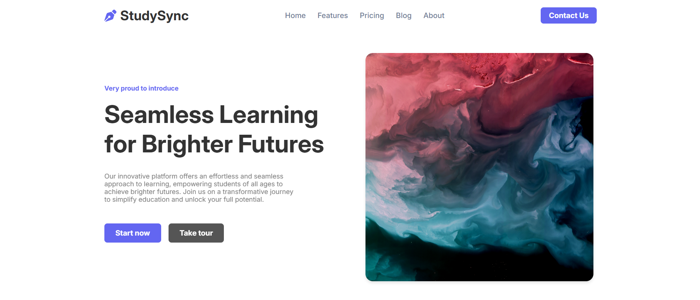
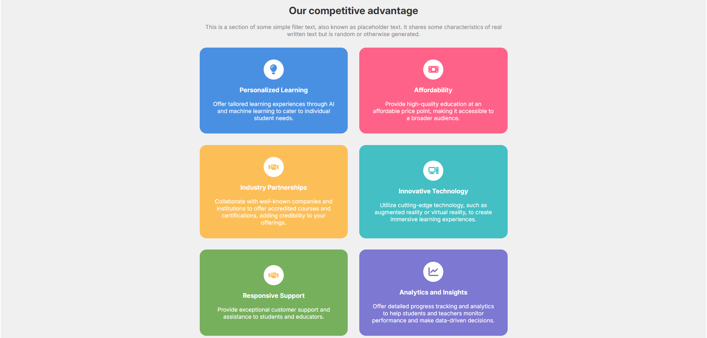
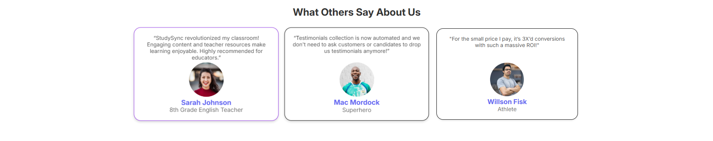
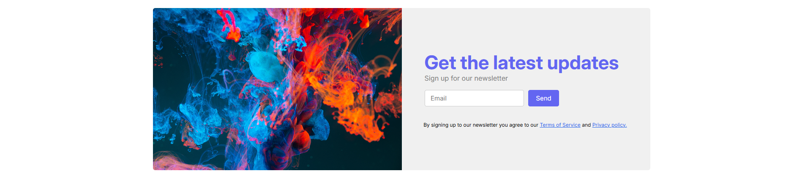
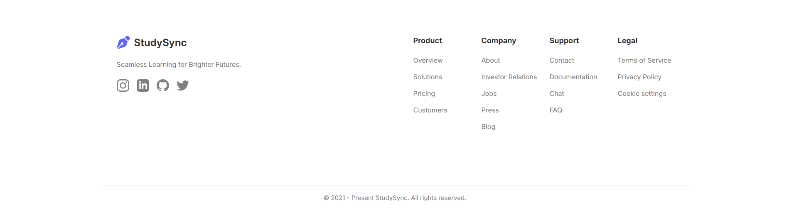

# StudySync Landing Page

A responsive landing page built using **HTML5** and **CSS3**.

## 📌 Project Overview

StudySync is a modern frontend landing page project focused on practicing core web design principles, including:

* **Responsive Web Design**
* **CSS Flexbox & CSS Grid**
* **Media Queries**
* **Card Layouts**
* **Hero Sections**
* **Testimonials UI**
* **Newsletter Subscription Section**

This project was created as part of my frontend development practice.

## 🚀 Features

* **Responsive Navigation Bar**
* **Hero Section** with CTA (Call-to-Action) Buttons
* **Trusted Companies** Section
* **Feature Cards** Section
* **Testimonials** Section
* **Newsletter Subscription** UI
* **Hover Effects** for interactive elements
* **Fully Responsive Layout** using Media Queries

## 🛠️ Technologies Used

* **HTML5**
* **CSS3** (Flexbox, Grid, Media Queries)

## 📸 Screenshots

### Navigation & Hero Section


### Trusted Companies Section


### Features Section


### Testimonials Section


### Newsletter Section


### Footer Section


## 📁 Folder Structure

```text
StudySyn Project/
│
├── images/
│   ├── avatar1.png
│   ├── avatar2.png
│   ├── avatar3.png
│   ├── img.png
│   ├── usgs-hoS3dzgpHzw-unsplash.jpg
│   ├── Affordability.svg
│   ├── Analytics.svg
│   ├── Google.svg
│   ├── Hamburger.svg
│   ├── IndustryPartner.svg
│   ├── InnovativeTech.svg
│   ├── Microsoft.svg
│   ├── PersonalizedLearn.svg
│   ├── StudySyn.svg
│   ├── VectorEdu.svg
│   ├── github.svg
│   ├── instagram.svg
│   ├── linkedin-copy.svg
│   └── twitter.svg
│
├── screenshots/
│   ├── nav-hero.png
│   ├── company.png
│   ├── feature.png
│   ├── testimonial.png
│   ├── newsletter.png
│   └── footer.png
│
├── index.html
├── style.css
└── README.md

```

## 👨‍💻 Author

**Nikhil Raj**

---

